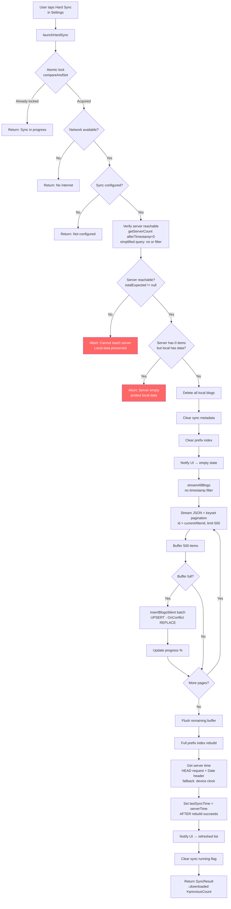
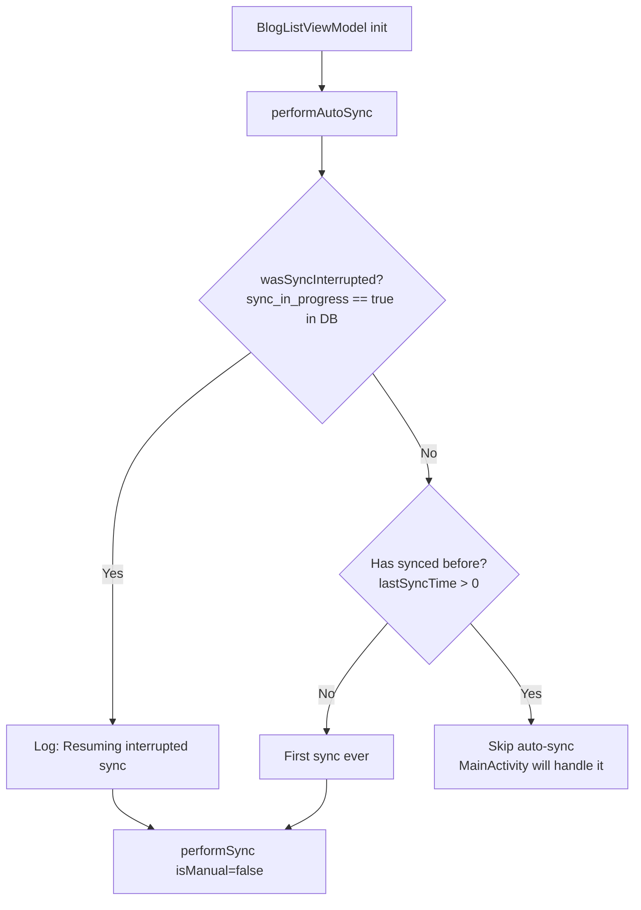
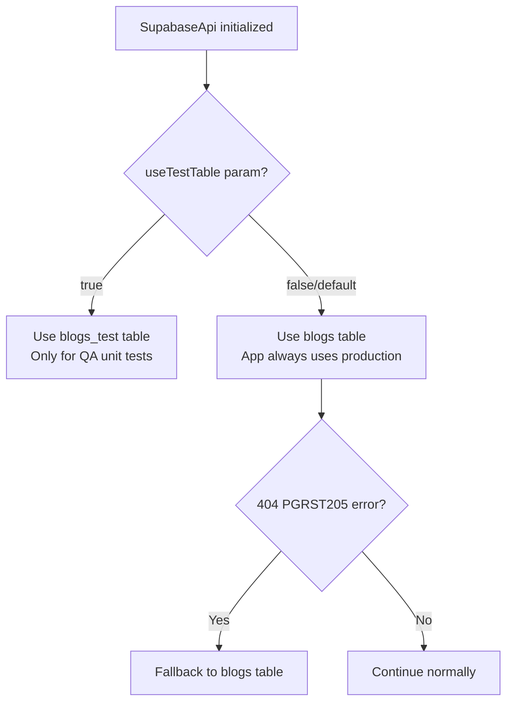

# SyncPad Sync Flow

## App Open → Incremental Sync

```mermaid
flowchart TD
    A[App Opens - MainActivity] --> B{Sync configured?<br/>API key + Base URL}
    B -- No --> Z1[Skip sync]
    B -- Yes --> C{Sync already running?}
    C -- Yes --> Z1
    C -- No --> D[Delay 1 second]
    D --> E[launchIncrementalSync]

    E --> F{Atomic lock<br/>compareAndSet}
    F -- Already locked --> Z2[Return: Sync in progress]
    F -- Acquired --> G{Network available?}
    G -- No --> Z3[Return: No internet]
    G -- Yes --> H[Mark sync_in_progress = true in DB]

    H --> I[Get lastSyncTime from DB]
    I --> J{lastSyncTime > 0?}

    %% Check resume
    J -- Yes --> K{resumeFromId exists?}
    J -- No --> K
    K -- Yes --> RESUME[Resume mode]
    K -- No --> FRESH[Fresh incremental]

    %% STEP 1: Upload
    RESUME --> S1
    FRESH --> S1[STEP 1: Upload Local Changes]
    S1 --> S1A{lastSyncTime > 0?}
    S1A -- No --> S2
    S1A -- Yes --> S1B[Query local changes<br/>after lastSyncTime<br/>cursor: updatedAt, id]
    S1B --> S1C{Local changes found?}
    S1C -- No --> S2
    S1C -- Yes --> S1D[Batch upload to server<br/>upsertBlogs - chunks of 100]
    S1D --> S1E{Upload succeeded?}
    S1E -- No --> UERR[Abort sync immediately<br/>Return failure<br/>Will retry next sync]
    S1E -- Yes --> S1F{More batches?}
    S1F -- Yes --> S1B
    S1F -- No --> S2

    %% STEP 2: Download
    S2[STEP 2: Download Server Changes] --> S2A[Get server count<br/>for progress %]
    S2A --> S2B{Resuming?}
    S2B -- Yes --> S2C[streamBlogsAfterId<br/>lastSyncTime + resumeFromId]
    S2B -- No --> S2D[streamBlogsAfter<br/>lastSyncTime]

    S2C --> S2E[Stream JSON + keyset pagination<br/>id > currentAfterId, limit 500]
    S2D --> S2E

    S2E --> S2F[Buffer items in batch<br/>max 500 items ~2.5MB]
    S2F --> S2G{Buffer full?}
    S2G -- Yes --> S2H[insertBlogsSilent<br/>UPSERT - OnConflict REPLACE]
    S2H --> S2I[Update syncLastId<br/>only after success]
    S2I --> S2J{More pages?<br/>pageCount == 500}
    S2G -- No --> S2J
    S2J -- Yes --> S2E
    S2J -- No --> S2K[Flush remaining buffer]

    %% STEP 2.5: Deletions
    S2K --> S25[STEP 2.5: Handle Server Deletions]
    S25 --> S25A[getDeletedBlogIds<br/>is_deleted=true since lastSyncTime]
    S25A --> S25B{Deleted IDs found?}
    S25B -- Yes --> S25C[Hard delete locally<br/>deleteBlogsByIds]
    S25B -- No --> S3

    %% STEP 3-6
    S25C --> S3[STEP 3: Get server time<br/>HEAD request + Date header<br/>fallback: device clock]
    S3 --> S3A[Set lastSyncTime = serverTime]
    S3A --> S4{Affected prefixes?}
    S4 -- Yes --> S4A[STEP 4: Partial prefix<br/>index update]
    S4 -- No --> S5
    S4A --> S5[STEP 5: Notify UI<br/>dataChanged once]
    S5 --> S6[STEP 6: Clear sync progress<br/>syncInProgress = false]
    S6 --> DONE[Return SyncResult<br/>↓downloaded ↑uploaded ✕deleted]

    %% Error paths
    S2E -- Network lost --> ERR1{NetworkInterruptedException?}
    ERR1 -- Yes --> ERR1A[Keep syncInProgress = true<br/>Will auto-resume next launch]
    ERR1 -- No --> ERR1B[Clear syncInProgress<br/>Prevent infinite loop]

    style UERR fill:#f66,color:#fff
    style ERR1A fill:#f90,color:#fff
    style ERR1B fill:#f66,color:#fff
```

## Hard Sync (User-initiated from Settings)

```mermaid
flowchart TD
    A[User taps Hard Sync<br/>in Settings] --> B[launchHardSync]
    B --> C{Atomic lock<br/>compareAndSet}
    C -- Already locked --> Z1[Return: Sync in progress]
    C -- Acquired --> D{Network available?}
    D -- No --> Z2[Return: No internet]
    D -- Yes --> E{Sync configured?}
    E -- No --> Z3[Return: Not configured]

    %% Safety checks
    E -- Yes --> F[Verify server reachable<br/>getServerCount afterTimestamp=0<br/>simplified query: no or filter]
    F --> G{Server reachable?<br/>totalExpected != null}
    G -- No --> Z4[Abort: Cannot reach server<br/>Local data preserved]
    G -- Yes --> H{Server has 0 items<br/>but local has data?}
    H -- Yes --> Z5[Abort: Server empty<br/>protect local data]

    %% Clear and download
    H -- No --> I[Delete all local blogs]
    I --> J[Clear sync metadata]
    J --> K[Clear prefix index]
    K --> L[Notify UI → empty state]

    L --> M[streamAllBlogs<br/>no timestamp filter]
    M --> N[Stream JSON + keyset pagination<br/>id > currentAfterId, limit 500]
    N --> O[Buffer 500 items]
    O --> P{Buffer full?}
    P -- Yes --> Q[insertBlogsSilent batch<br/>UPSERT - OnConflict REPLACE]
    Q --> R[Update progress %]
    R --> S{More pages?}
    P -- No --> S
    S -- Yes --> N
    S -- No --> T[Flush remaining buffer]

    T --> U[Full prefix index rebuild]
    U --> V[Get server time<br/>HEAD request + Date header<br/>fallback: device clock]
    V --> VA[Set lastSyncTime = serverTime<br/>AFTER rebuild succeeds]
    VA --> W[Notify UI → refreshed list]
    W --> X[Clear sync running flag]
    X --> DONE[Return SyncResult<br/>↓downloaded ✕previousCount]

    style Z4 fill:#f66,color:#fff
    style Z5 fill:#f66,color:#fff
```

## Auto-Sync Decision on App Open (BlogListViewModel)

```mermaid
flowchart TD
    A[BlogListViewModel init] --> B[performAutoSync]
    B --> C{wasSyncInterrupted?<br/>sync_in_progress == true in DB}
    C -- Yes --> D[Log: Resuming interrupted sync]
    D --> E[performSync isManual=false]
    C -- No --> F{Has synced before?<br/>lastSyncTime > 0}
    F -- No --> G[First sync ever]
    G --> E
    F -- Yes --> H[Skip auto-sync<br/>MainActivity will handle it]
```

## Table Resolution

```mermaid
flowchart TD
    A[SupabaseApi initialized] --> B{useTestTable param?}
    B -- true --> C[Use blogs_test table<br/>Only for QA unit tests]
    B -- false/default --> D[Use blogs table<br/>App always uses production]
    D --> E{404 PGRST205 error?}
    E -- Yes --> F[Fallback to blogs table]
    E -- No --> G[Continue normally]
```
